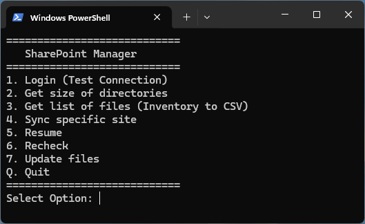

# PowerShell Sharepoint Ops (ps-sharepoint-ops)

This PowerShell script provides ability to sync files from multi sites of the same tenant. It has dry run, pause/resume and update functionalities. Useful where user account does not have Azure/AD Admin access. It uses "PnP.PowerShell" module to communicate to the Sharepoint host resources.



## Features

- **Interactive Menu:** Easy-to-use menu for various operations.
- **Multiple Site Management:** Manages a list of SharePoint sites from a `sites.txt` file.
- **Authentication:** Attempts modern interactive login and falls back to device code flow, making it compatible with multi-factor authentication (MFA).
- **Directory Size Calculation:** Scans and reports the size of document libraries within each configured site.
- **File Inventory:** Generates a detailed CSV inventory of all files in each site's document libraries, including metadata like size, path, and modification date.
- **Robust File Synchronization:**
  - **Initial Sync:** Downloads all files from a SharePoint site to a local directory.
  - **Resume:** Resumes downloads if a previous operation was interrupted.
  - **Recheck:** Verifies the integrity of local files against the server inventory and re-downloads mismatched or missing files.
  - **Update:** Refreshes the file inventory and downloads only new or updated files.
- **Logging:** Keeps a record of operations and errors in `session.log`.

## Prerequisites

- **PowerShell:** Version 5.1 or later.
- **PnP.PowerShell Module:** This script relies heavily on the `PnP.PowerShell` module. If you don't have it installed, run the following command in PowerShell:
  ```powershell
  Install-Module -Name PnP.PowerShell -Scope CurrentUser
  ```

## Setup

1. **Create `sites.txt`:** In the same directory as the script, create a file named `sites.txt`.
2. **Add Site URLs:** Add the full URL of each SharePoint site you want to manage to this file, one URL per line. For example:
   ```
   https://yourtenant.sharepoint.com/sites/Site1
   https://yourtenant.sharepoint.com/sites/Site2
   ```

## Usage

Run the script from a PowerShell console:

```powershell
.\SharePoint-Manager.ps1
```

You will be presented with the following menu:

- **1. Login (Test Connection):** Tests the connection to the first site listed in `sites.txt` to ensure your credentials are correct.
- **2. Get size of directories:** Calculates and displays the total size of all document libraries for each site.
- **3. Get list of files (Inventory to CSV):** Creates a CSV file for each site containing a list of all files, their sizes, and other metadata. This must be run before you can sync.
- **4. Sync specific site:** Downloads all files from a selected site based on the inventory.
- **5. Resume:** Resumes an incomplete download operation.
- **6. Recheck:** Compares local files with the inventory and re-downloads any that are missing or have a size mismatch.
- **7. Update files:** Refreshes the inventory from the server and downloads any new or changed files.
- **Q. Quit:** Exits the script.

## File Structure

The script will create the following files and directories:

- **`Output/`**: This directory is created to store all output.
  - **`<SiteName>/`**: A subdirectory for each managed site.
    - **`inventory_<SiteName>.csv`**: The file inventory for the site.
    - **`sync_tracking.csv`**: Tracks the download status of each file.
    - **`Files/`**: The local destination for downloaded files from the site.
- **`session.log`**: A log file for all script operations.
- **`sites.txt`**: The user-created file listing the target SharePoint sites.

## Disclaimer

There is no write/upload functionality in the script hence it is safe to use, but do assess if using in a sensitive environment.
